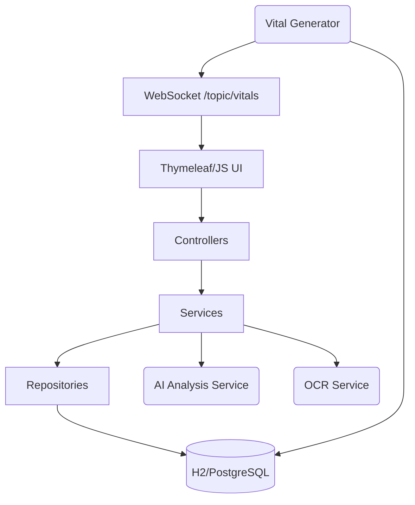

# HealthWatch AI

Enterprise-Grade AI-Powered Real-Time Patient Health Monitoring System

## Overview

HealthWatch AI is a production-ready, Spring Boot 3 based web application that enables healthcare providers to monitor multiple patients simultaneously. It features real-time IoT vital simulation via WebSockets, AI-powered medical report analysis, automated alerts, and an integrated AI chatbot for clinical assistance.

## Technologies Used

*   **Backend:** Java 21, Spring Boot 3.2, Spring Security, Spring Data JPA, Hibernate, WebSockets (STOMP)
*   **Frontend:** Thymeleaf, Bootstrap 5, Chart.js, SockJS
*   **Databases:** H2 (Development), PostgreSQL (Production)
*   **DevOps:** Docker, Docker Compose, Maven
*   **Documentation:** Swagger / OpenAPI 3

## Architecture

The application follows Clean Architecture principles with interface-based dependency injection for critical modules like OCR and AI Analysis, making them highly extensible and provider-agnostic.



## Running the Application

### 1. Running Locally (Development)

Prerequisites: Java 21 & Maven.

```bash
./mvnw clean install
./mvnw spring-boot:run
```

Access the application at: `http://localhost:8081`

**Default Credentials:**
*   **Username:** admin
*   **Password:** password

### 2. Running via Docker (Production)

To run the application along with a PostgreSQL database using Docker Compose:

```bash
docker-compose up -d --build
```

Access the application at: `http://localhost:8081`

## Features

1.  **Patient Dashboard:** Real-time monitoring of all admitted patients.
2.  **WebSocket Vitals:** Live updates for Heart Rate, Blood Pressure, SpO2, and Temperature every 3 seconds.
3.  **Alert Engine:** Configurable thresholds automatically generate Warnings and Critical alerts.
4.  **AI Report Analysis:** Upload PDF/Image reports to extract data via OCR and get AI-generated health summaries correlated with live vitals.
5.  **AI Chatbot:** Ask questions regarding medical terms, reports, and general health knowledge.
6.  **Historical Analytics:** Export vitals history to CSV and view trend charts.
7.  **Swagger UI:** Access API documentation at `http://localhost:8081/swagger-ui.html`.
